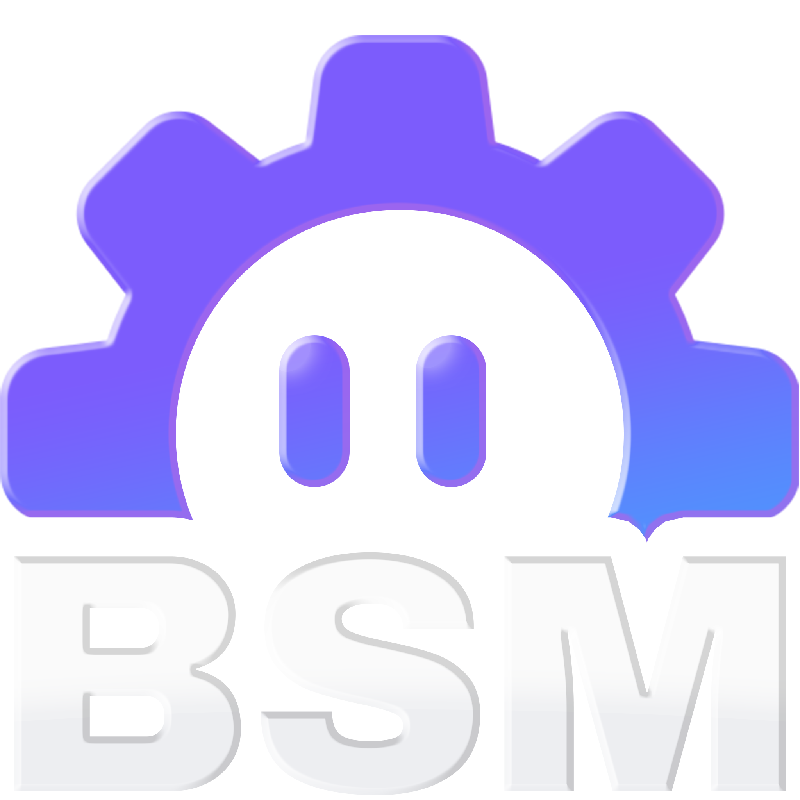

<!-- HEADER -->

  

<!-- MAIN INFORMATION -->

  <a href="#-nk-bot-service-manager---interactive-discord-bot-manager">Overview</a> •
  <a href="/CHANGELOG.md">Changelog</a> •
  <a href="https://nicekype.de">Website</a> •
  <a href="https://github.com/NiceKype/NK-Bot-Service-Manager?tab=License-1-ov-file">License</a> 
  
  
  
  
  
  
  

 

<!-- DESCRIPTION -->
#  NK Bot Service Manager - Interactive Discord Bot Manager
The name already suggests what the tool can do. But it can do much more than just password-protect folders.
I was tired of constantly protecting folders with .htaccess and .htpasswd. Most web server users are familiar with this. This pop-up window where you enter your login credentials looks incredibly ugly and uninspired.
I programmed a web app with FolderManager that makes the whole thing more attractive and technically sophisticated.
With a full-fledged user system, a user interface, and an ACP for managing accounts and access, the simple pop-up window becomes a more enjoyable experience!

 

<!-- FEATURES -->
## 》FEATURES
- Adding Discord Bots that normally starts with batch, exe, cmd, python or node file
- Live console with colored info, system, error and input messages
- Full implimented log system
- Multi language (currently englisch and german) and all time formats
- System Tray Icons for more and direct interaction per bot
- Custom System Tray Icons per bot

 

<!-- PREVIEW -->
## 》PREVIEW
> [!IMPORTANT]
> The preview images will follow as soon as the tool is released!

 

<!-- PLANNED FEATURES -->
## 》PLANNED FEATURES
- [ ] Linux compatibility with fully integrated web tool

 

<!-- SUPPORT -->
## 》SUPPORT

 

> [!TIP]
> You want a translation of the tool in your language and it's currently not available, then you can help us by request your language and submit a translation [HERE](https://crowdin.com/project/nkfoldermanager).

**Status of the translation:** 

 

<!-- LICENSE -->
## 》LICENSE
🛡️ This tool is licensed under: [NKS-Public-License (NKPL-1.1)](/LICENSE) – see terms before using or modifying this code.
