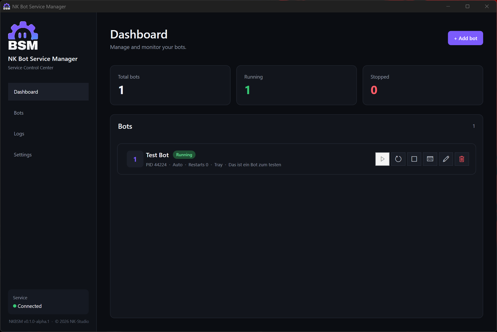
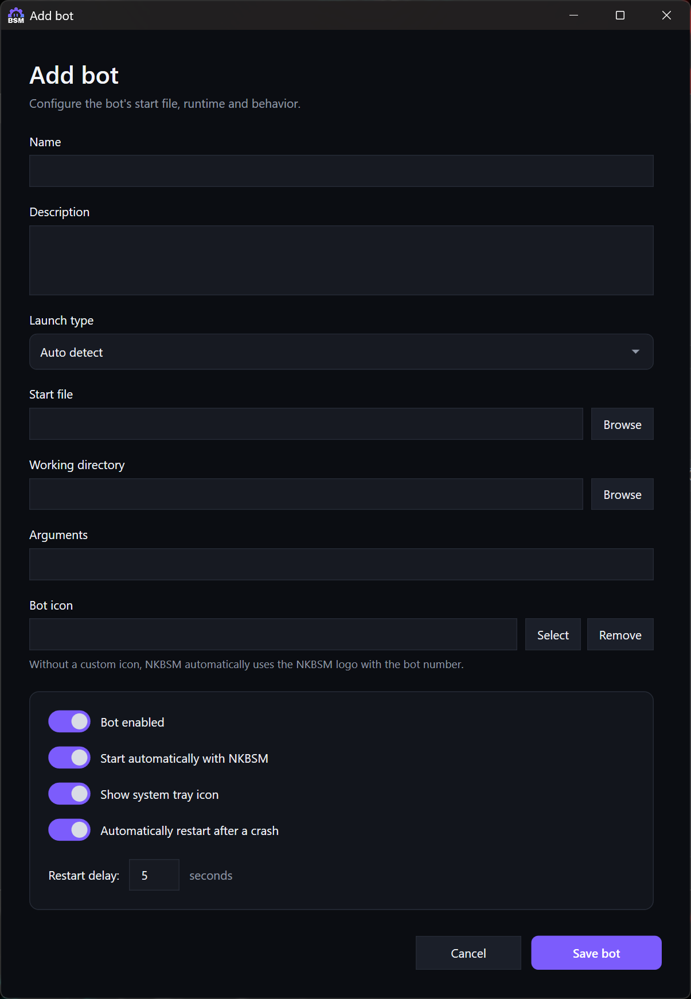
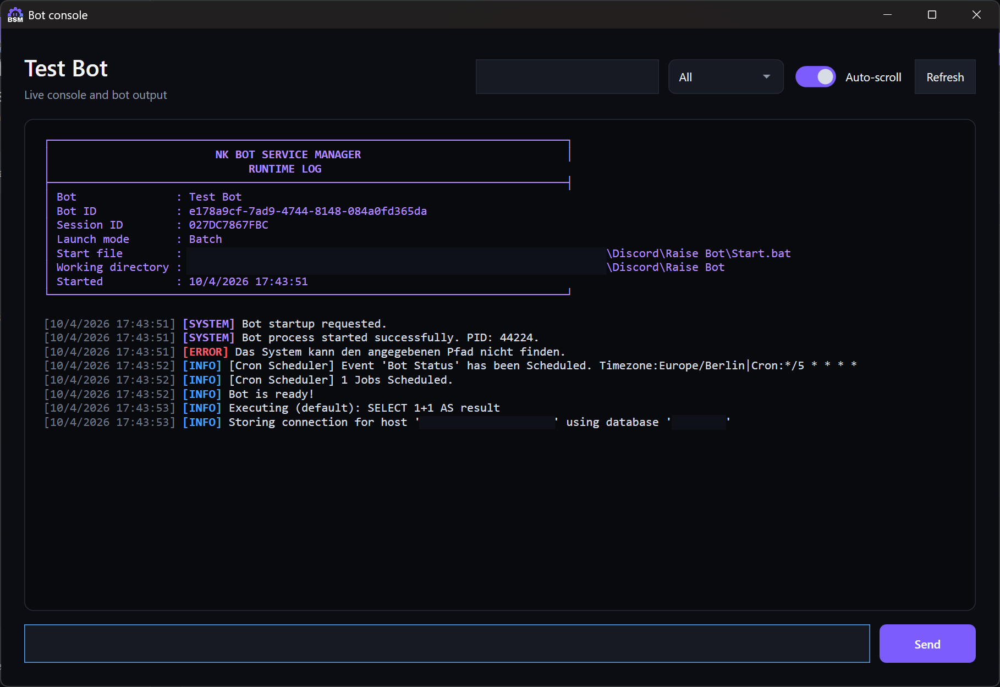
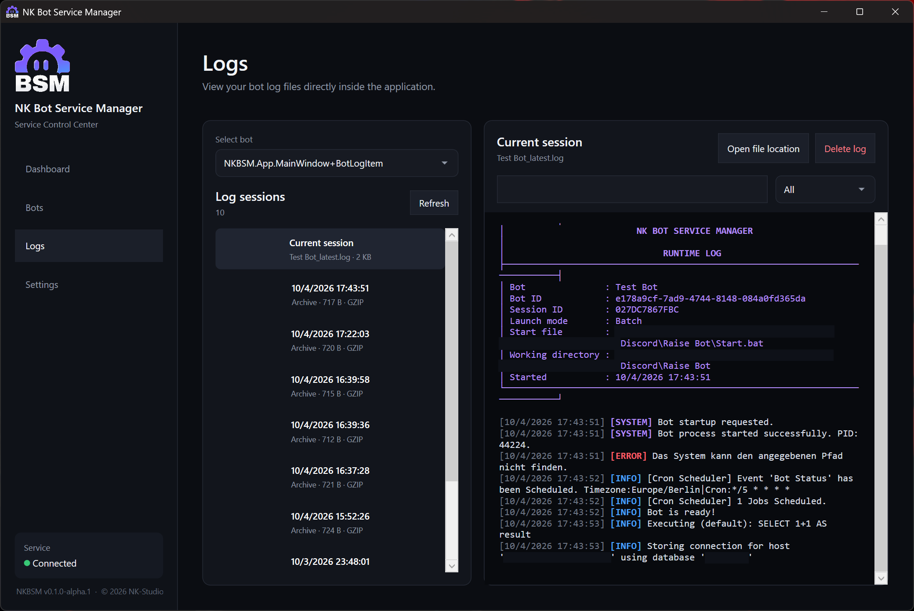
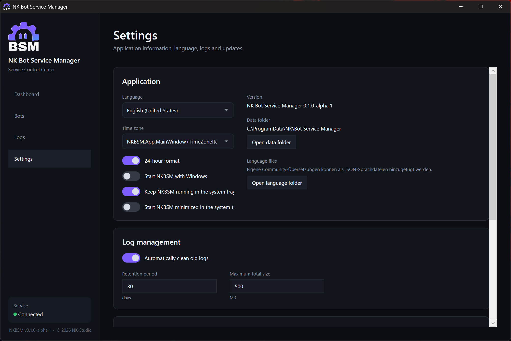
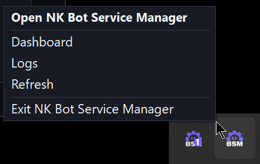
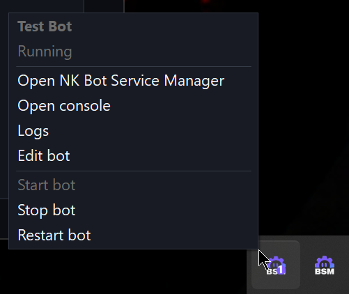
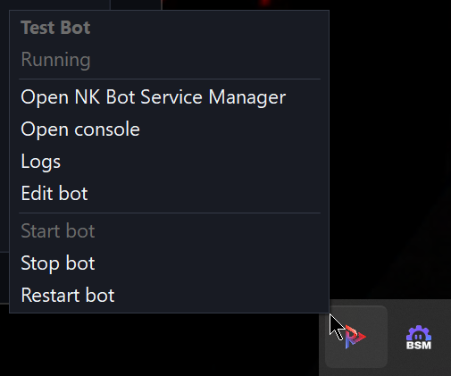

<!-- HEADER -->

  

<!-- MAIN INFORMATION -->

  <a href="#-nk-bot-service-manager---interactive-discord-bot-manager">Overview</a> •
  <a href="/CHANGELOG.md">Changelog</a> •
  <a href="https://nicekype.de">Website</a> •
  <a href="https://github.com/NiceKype/NK-Bot-Service-Manager?tab=License-1-ov-file">License</a> 
  
  
  
  
  
  
  

 

<!-- DESCRIPTION -->
<!-- DESCRIPTION -->
#  NK Bot Service Manager
**NK Bot Service Manager (NKBSM)** is a Windows application for centrally running, monitoring and managing Discord bots and other background applications.
Instead of running every bot in a separate terminal window or maintaining multiple startup scripts and services manually, NKBSM provides a single management interface backed by a dedicated Windows service.
Bots can be started from Batch/CMD files, executables, Python scripts or Node.js applications. NKBSM provides process control, automatic crash recovery, live console access, session-based logging, system tray integration and centralized configuration.
The desktop application can be closed independently while the NKBSM Windows Service continues managing configured bots in the background.

> [!WARNING]
> NK Bot Service Manager is currently in **Alpha**. Features, configuration formats and behavior may change before the first stable release.

 

<!-- FEATURES -->
## 》FEATURES

### Bot Management
- Add, edit and remove managed bots
- Start, stop and restart bots from one central interface
- Automatic launch type detection
- Supported bot/application types:
  - Batch / CMD
  - Executables
  - Python
  - Node.js
- Custom working directories and command-line arguments
- Optional custom runtime executables
- Automatic restart after crashes
- Configurable restart delay
- Automatic bot startup

### Live Console
- Live bot output directly inside NKBSM
- Send commands to supported bot processes
- Colored INFO, SYSTEM, ERROR and INPUT messages
- Search console output
- Filter output by log level
- Optional automatic scrolling

### Logging
- Separate log session for every bot start
- Current session available as `BotName_latest.log`
- Automatic archival of previous sessions
- GZIP compression of archived logs
- Bot → Session log browser
- Search and log-level filtering
- Configurable automatic cleanup
- Configurable retention period and maximum log storage

### System Tray
- Main NKBSM system tray icon
- Optional individual tray icon for every bot
- Custom bot icons
- Automatic numbered NKBSM fallback icons
- Start, stop and restart bots directly from the tray
- Open console, logs or bot configuration from the tray
- Automatic Windows light/dark mode detection
- NKBSM-themed hover styling
- Close application window to tray
- Optional minimized startup

### Localization
- English (`en-US`)
- German (`de-DE`)
- Community-extensible JSON language system
- Crowdin integration for community translations
- Configurable time zone
- 12-hour and 24-hour time formats

### Updates & Installation
- Automatic update checks through GitHub Releases
- Manual update checking
- Integrated changelog display
- Self-contained Windows x64 installation
- Automatic installation and startup of the NKBSM Windows Service
- Existing bot configuration, settings and logs are preserved during updates

 

<!-- PREVIEW -->
## 》PREVIEW

### Dashboard

### Bot Management

### Live Console

### Logs

### Settings

### Tray Icon + Menu

 

<!-- PLANNED FEATURES -->
## 》PLANNED FEATURES

- [ ] Linux support through a dedicated NKBSM agent/service
- [ ] Web-based NKBSM Control Center
- [ ] Remote management of Windows and Linux NKBSM instances
- [ ] Cross-platform NKBSM Core shared between Windows and Linux
- [ ] Real-time browser console and logs
- [ ] Secure remote API for NKBSM agents
- [ ] Extended bot monitoring and runtime statistics
- [ ] Improved bot health and crash diagnostics
- [x] Additional community translations through Crowdin
- [ ] Automated Crowdin → GitHub language synchronization
- [ ] Further installer and updater improvements
- [ ] Stable `1.0.0` release after the Alpha/Beta testing phases

 

<!-- SUPPORT -->
## 》SUPPORT

 

> [!TIP]
> You want a translation of the tool in your language and it's currently not available, then you can help us by request your language and submit a translation [HERE](https://crowdin.com/project/nk-bot-service-manager).

**Status of the translation:** 

 

<!-- LICENSE -->
## 》LICENSE
🛡️ This tool is licensed under: [NKS-Public-License (NKPL-1.1)](/LICENSE) – see terms before using or modifying this code.
